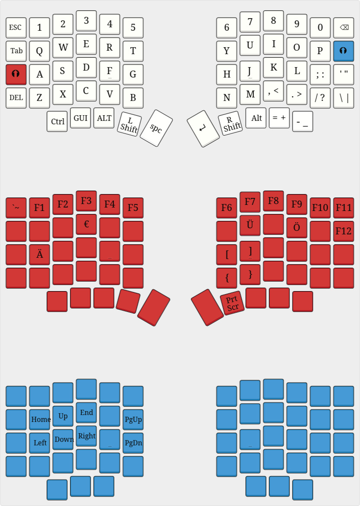
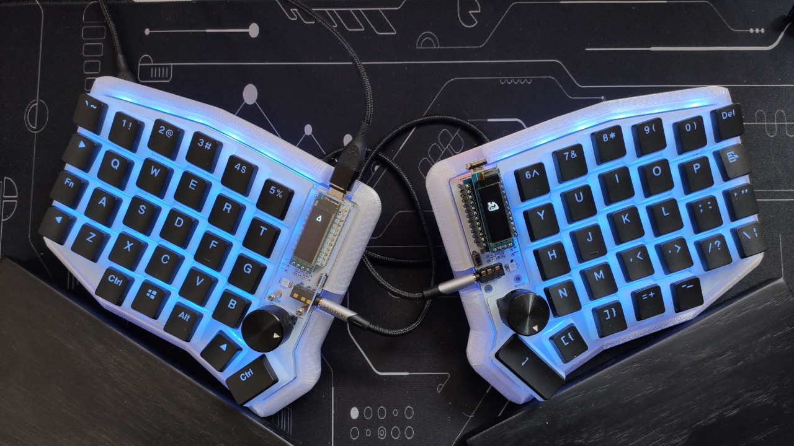
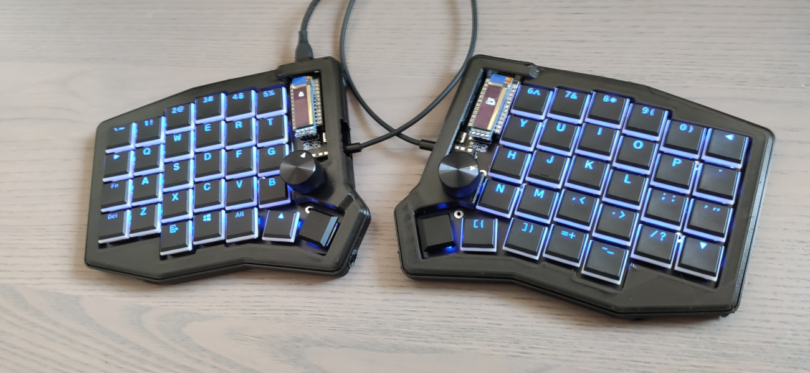

# Sofle Split ErgoMech

Currently I own two Sofles, a RGB and a Choc. I use the same layout and features on both of them, at least if possible. The Choc has for example no downlight LEDs and no indicators
Besides that I've build both with 2 OLEDs and 2 rotary encoders
Both have 3D printed tilted cases

- Extra Layer for Umlauts, F1 to F12 and rarely used function keys
- Layer of cursor and movement keys
- Left OLED: Display of current layer and activated modifiers
- Right OLED: WPM counter and wpm dependend Neko animation

TODOs:
- Setup Matrix LED 
- Space Cadet maybe?
- Re-enable CapsWord
- Update Sofle Choc variant

[Layout](http://www.keyboard-layout-editor.com/#/gists/1e62fbb4f1adce56eced4e547606cf52)

## Sofle RGB

 - Keys: Gazzew U4 RGB
 - Keycaps: Pudding Black
 
 Thanks to some messing around my left side has a MCU with dfu bootloader, my right side with caterina

## Sofle Choc

Note: Currently outdated and needs some rework for current QMK version!

- Keys: Kailh red choc
- Keycaps: Pudding Black

